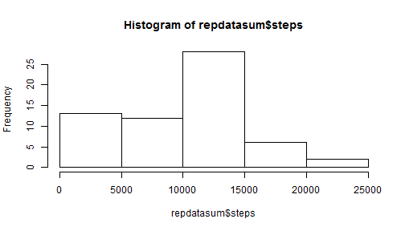

This is an R Markdown document for the peer assessment 1, reproducible research on coursera(https://class.coursera.org/repdata-034)


## Loading and preprocessing the data

```r
# clean memory
rm(list=ls(all=TRUE))
library(plyr)
library(ggplot2)
#setwd("D:/videoCourse/Reproducible_research/Assignment1")

repdata <- read.csv(file = "activity.csv", header = T)
```

## What is the mean total number of steps taken per day?


```r
repdatasum <- ddply(repdata,.(date),summarise,steps = sum(steps,na.rm=TRUE))
summary(repdatasum)
```

```
##          date        steps      
##  2012-10-01: 1   Min.   :    0  
##  2012-10-02: 1   1st Qu.: 6778  
##  2012-10-03: 1   Median :10395  
##  2012-10-04: 1   Mean   : 9354  
##  2012-10-05: 1   3rd Qu.:12811  
##  2012-10-06: 1   Max.   :21194  
##  (Other)   :55
```

Here is the histogram of total number of steps tabken per day.

```r
hist(repdatasum$steps)
```

 


```r
meanSteps <- mean(repdatasum$steps)
medianSteps <-median(repdatasum$steps)
```

The mean of the total steps taken by each day is 9354.2295082;
The median of the total steps tabken by each day is 10395.

## What is the average daily activity pattern?

Here is the time series plot of the 5-minutes interval x-axis and the average number of steps taken, averaged across all dayd (y-axis)

```r
repdataSeries <- ddply(repdata,.(interval),summarise,steps = mean(steps,na.rm=TRUE))
ggplot(repdataSeries,aes(interval,steps)) + geom_line() + xlab("") + ylab("Average steps")
```

 

```r
maxIndex <- which.max(repdataSeries$steps)
maxInterval <- repdataSeries[maxIndex,1]
```
The interval, onaverage across all the days in the dataset, contains the maximum number of steps is 835.


## Imputing missing values


```r
numNAs <- sum(is.na(repdata$steps)) # number of NA
```
The total number of missing values in the dataset is 2304;


```r
impute.mean <- function(x) replace(x, is.na(x), mean(x, na.rm = TRUE))
repdatanew <- ddply(repdata,~interval,transform,steps = impute.mean(steps))
```

Here is the histogram of new data.

```r
repdatasumnew <- ddply(repdatanew,.(date),summarise,steps = sum(steps,na.rm=TRUE))

hist(repdatasumnew$steps)
```

 

```r
meanStepsnew <- mean(repdatasumnew$steps)
medianStepsnew <-median(repdatasumnew$steps)
```
The new mean of the total steps taken by each day is 1.0766189 &times; 10<sup>4</sup>;
The new median of the total steps tabken by each day is 1.0766189 &times; 10<sup>4</sup>.

The resutls showed that the mean and median of total steps per day is changed.

## Are there differences in activity patterns between weekdays and weekends?

```r
multiplot <- function(..., plotlist=NULL, cols) {
    require(grid)

    # Make a list from the ... arguments and plotlist
    plots <- c(list(...), plotlist)

    numPlots = length(plots)

    # Make the panel
    plotCols = cols                          # Number of columns of plots
    plotRows = ceiling(numPlots/plotCols) # Number of rows needed, calculated from # of cols

    # Set up the page
    grid.newpage()
    pushViewport(viewport(layout = grid.layout(plotRows, plotCols)))
    vplayout <- function(x, y)
        viewport(layout.pos.row = x, layout.pos.col = y)

    # Make each plot, in the correct location
    for (i in 1:numPlots) {
        curRow = ceiling(i/plotCols)
        curCol = (i-1) %% plotCols + 1
        print(plots[[i]], vp = vplayout(curRow, curCol ))
    }

}

repdatanew$date <- strptime(repdatanew$date, "%Y-%m-%d")
weekdays1 <-  c('Monday', 'Tuesday', 'Wednesday', 'Thursday', 'Friday')
repdatanew$wday <- factor((weekdays(repdatanew$date) %in% weekdays1),levels=c(FALSE, TRUE), labels = c('weekend','weekday'))
repdataSeriesnew <- ddply(repdatanew,.(interval,wday),summarise,steps = mean(steps,na.rm=TRUE))
pweekday <- ggplot(subset(repdataSeriesnew,wday == "weekday"),aes(interval,steps)) + geom_line() + xlab("") + ylab("Average steps")
pweekend <- ggplot(subset(repdataSeriesnew,wday == "weekend"),aes(interval,steps)) + geom_line() + xlab("") + ylab("Average steps")
multiplot(pweekday,pweekend,cols=1)
```

 
